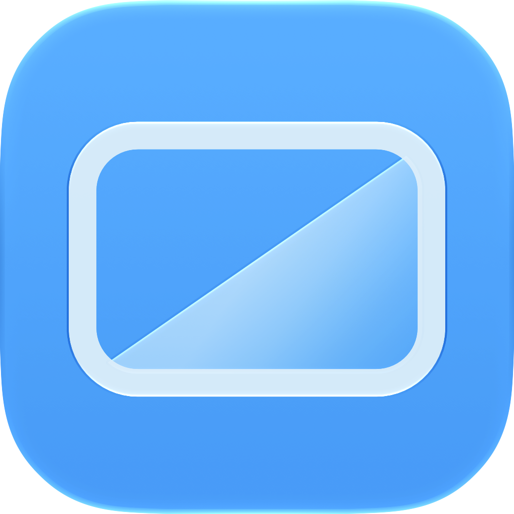
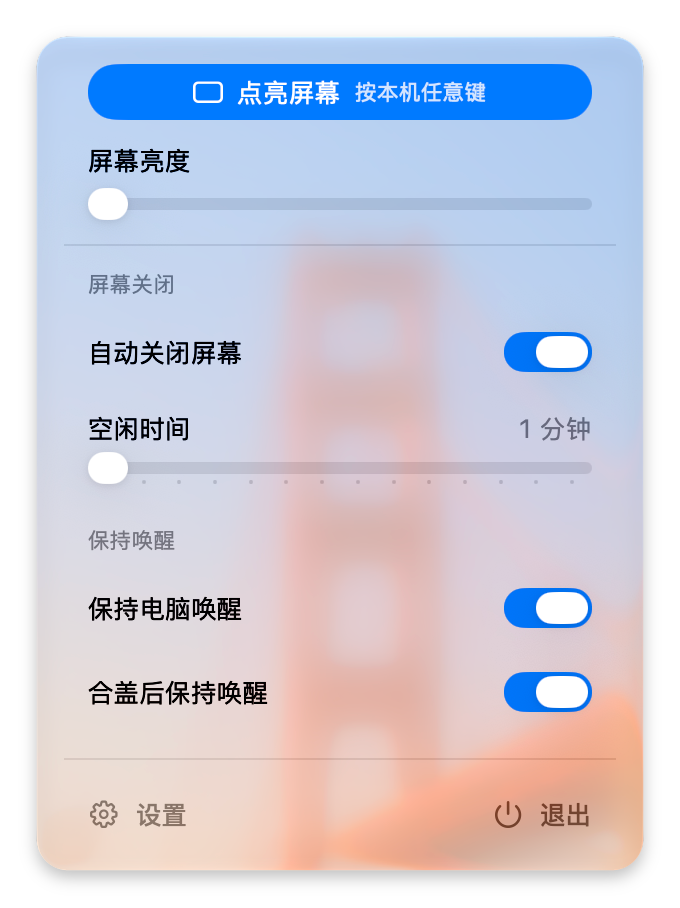
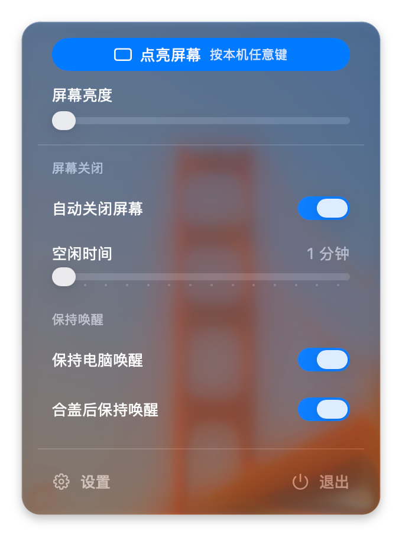

<h1 align="center"> Screen Off</h1>

English · <a href="README.zh-CN.md">简体中文</a>

<strong>Keep your Mac awake with the screen off.</strong>

Screen Off is made for vibe coding and remote Mac setups. It turns off the built-in display and keyboard backlight when the MacBook is idle, while keeping the Mac online. With Input Monitoring allowed, remote control does not light the local display; touch the Mac's keyboard or trackpad to restore the previous brightness.

  
  

## What it does

- Turn the display off now or automatically after an idle period.
- Keep the Mac awake while remote input leaves the local display dark.
- Restore the previous display and keyboard brightness when local input returns.

## Download

Download [ScreenOff.dmg](https://github.com/imetn/ScreenOff/releases/latest/download/ScreenOff.dmg), then drag Screen Off into Applications.

Requires macOS 14 or later and an Apple Silicon MacBook.

## Permission and privacy

Automatic screen off uses Input Monitoring to tell local keyboard and trackpad activity from remote input. Screen Off does not read or store keystrokes, pointer positions, screen content, or remote sessions.

## License

[MIT](LICENSE)
